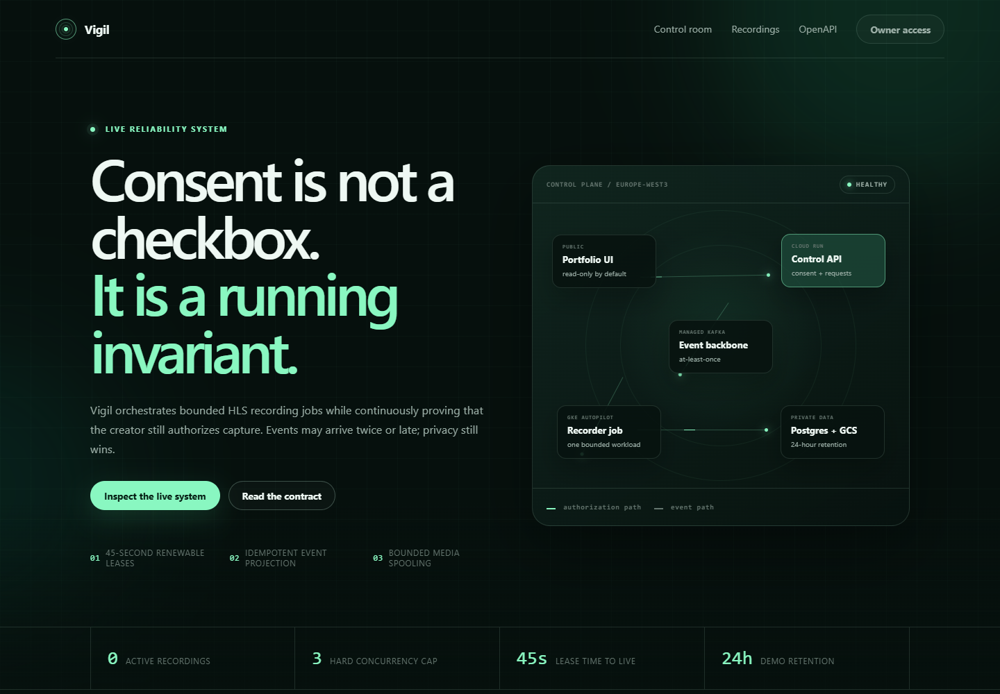
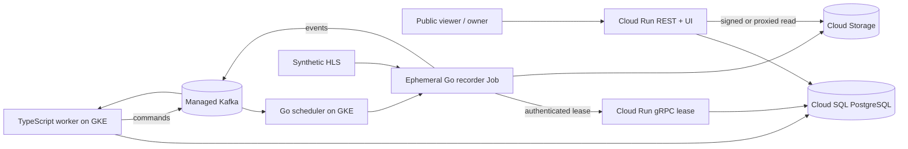

# Vigil

Vigil is a consent-gated live-stream recording control plane. It records one fixed synthetic HLS source, turns the capture into a short MP4, and exposes the lifecycle as an inspectable event timeline. Public visitors can read the system state and play completed demos; only an owner-authenticated session can grant consent, start work, revoke consent, or stop a recording.

> The core rule is simple: authorization is leased continuously. Losing consent or losing contact with the lease service stops capture and prevents playback exposure.

[](https://github.com/fullstack-nick/vigil/actions/workflows/verify.yml)

<!-- LIVE_DEMO_START -->
[Open the live Vigil control room](https://vigil-api-daztunbrsq-ey.a.run.app) — public state and completed demo playback are read-only; recording controls require the owner credential.
<!-- LIVE_DEMO_END -->

<!-- SCREENSHOT_START -->

<!-- SCREENSHOT_END -->

## What this demonstrates

- A real HLS-to-MP4 media path with bounded disk, upload concurrency, duration, and Kubernetes resources.
- Consent that is checked at request time and continuously through a 45-second renewable lease.
- A PostgreSQL transactional outbox, Kafka commands/events, deterministic recorder Jobs, and an idempotent projection rebuilt from event history.
- Duplicate and out-of-order delivery handling, integrity-conflict quarantine, fail-closed cancellation, retention, metrics, alerts, and incident operations.
- Isolated GCP infrastructure: Cloud Run, private Cloud SQL, Managed Service for Apache Kafka, GKE Autopilot, Cloud Storage, Secret Manager, and keyless workload identity.

## Architecture



The public HTTP service and the IAM-protected native gRPC lease service are separate Cloud Run services. Continuous consumers run on GKE instead of relying on request-scoped background execution. See [the architecture walkthrough](docs/architecture.md) and [the decisions](docs/adr/README.md).

## Correctness boundaries

1. A recording row and its start command enter PostgreSQL in one transaction.
2. Replaying the same HTTP idempotency key returns the original recording; changing its payload is rejected.
3. Kafka is at-least-once. Event IDs, attempt sequences, Job names, and object names are deterministic.
4. The projector stores raw events, detects byte-level identity conflicts, sorts the complete attempt history, and runs one pure reducer.
5. A completion event is projected only after the expected final object exists with the exact reported size.
6. Revocation or stop blocks renewal. The recorder cancels FFmpeg and uploads, deletes partial media, emits one terminal stop event, and clears its spool.
7. A lost recorder becomes terminal through Kubernetes Job reconciliation or expired-lease reconciliation; no seamless-resume claim is made.

## Local demo

Prerequisites: Node 24, pnpm 11, Go 1.26, Docker, FFmpeg/ffprobe, Buf, Terraform, and kubectl.

```powershell
corepack enable
pnpm install --frozen-lockfile
pnpm verify
pnpm test:local
```

`pnpm test:local` builds and starts PostgreSQL, single-node Kafka KRaft, fake GCS, a synthetic HLS source, and all application processes. It proves the anonymous control denial, consent gate, idempotent request replay, event-driven recording, final H.264/AAC MP4, and playback. The local owner credential is `vigil-local-owner`; it is intentionally local-only.

The focused failure suite is manual and deliberately excluded from CI:

```powershell
pnpm test:failures
```

It exercises duplicate delivery, out-of-order projection, projector restart, consent revocation, and abrupt recorder death with bounded timeouts and cleanup.

## API sketch

```http
GET /api/public/summary
GET /api/public/recordings
GET /api/public/recordings/{recordingId}
GET /api/public/recordings/{recordingId}/media

POST /api/operator/session
PUT  /api/creators/{creatorId}/consent
POST /api/recordings                 # requires Idempotency-Key
POST /api/recordings/{recordingId}/stop
```

The running service publishes its generated OpenAPI document at `/openapi.json`. Authenticated examples are in [docs/api-examples.md](docs/api-examples.md).

## Deployment and operations

The deployed environment is deliberately substantial: minimum-size Managed Kafka, a private single-zone Cloud SQL instance, GKE Autopilot workloads, one minimum Cloud Run lease instance, and regional object storage. These are paid, always-on resources; promotional credits and a budget alert do not make them free, and a budget is not a spending cap.

All resources use a `vigil-` prefix and isolated Terraform states inside the explicitly selected existing project. No default workload identity or static service-account key is used. See:

- [cloud deployment and teardown](docs/deployment.md)
- [operator runbook](docs/runbook.md)
- [threat notes](docs/threat-model.md)
- [failure and incident record](docs/postmortem.md)
- [implementation plan and preserved baseline](PLAN.md)

CI is intentionally small: generated-contract drift, TypeScript and Go builds, Terraform/Kustomize validation, branding isolation, and secret scanning. Deployment is a manual GitHub Actions workflow using OIDC federation.

## Scope

Vigil is a portfolio demonstration, not a general-purpose recorder. The deployed source is fixed to an in-cluster synthetic H.264/AAC stream. Arbitrary URLs, multi-tenant accounts, DRM, transcoding, resumable capture, and indefinite retention are out of scope.

Licensed independently under [Apache License 2.0](LICENSE).
