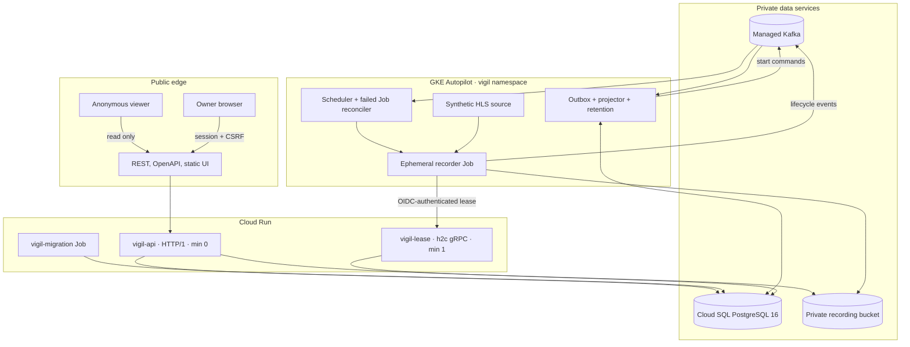
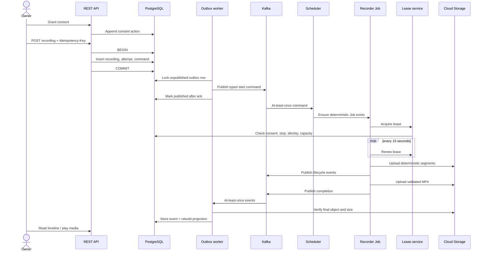
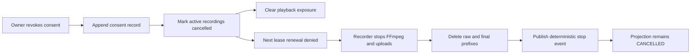
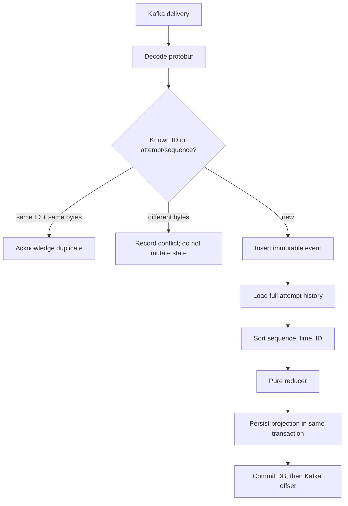

# Architecture and failure flows

## Control and data planes

Vigil separates cheap public reads from spend-causing mutations and separates request handling from continuous event processing.

Cloud Run reaches Cloud SQL through Direct VPC egress and the Cloud SQL connector. GKE reaches it through a Cloud SQL Auth Proxy sidecar. Managed Kafka and the synthetic source are reachable only through the dedicated VPC. Workloads use distinct Kubernetes and Google service accounts joined by Workload Identity Federation.

## Successful recording sequence

## Revocation flow

If the lease endpoint is unavailable, the recorder keeps the last expiry as a hard deadline and stops before authorization becomes uncertain. A killed Kubernetes recorder reaches a failed Job; the scheduler publishes a deterministic `JOB_FAILED` event. Locally, the maintenance loop turns an abandoned expired lease into `FAILED`.

## Event projection

The approach is intentionally simple for the bounded history. It gives delayed events a place in history without letting arrival order regress state.
